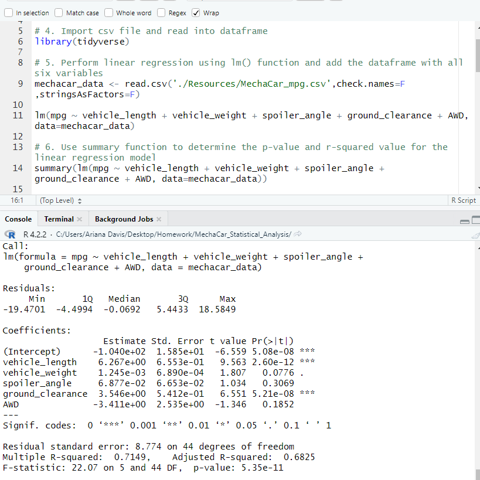
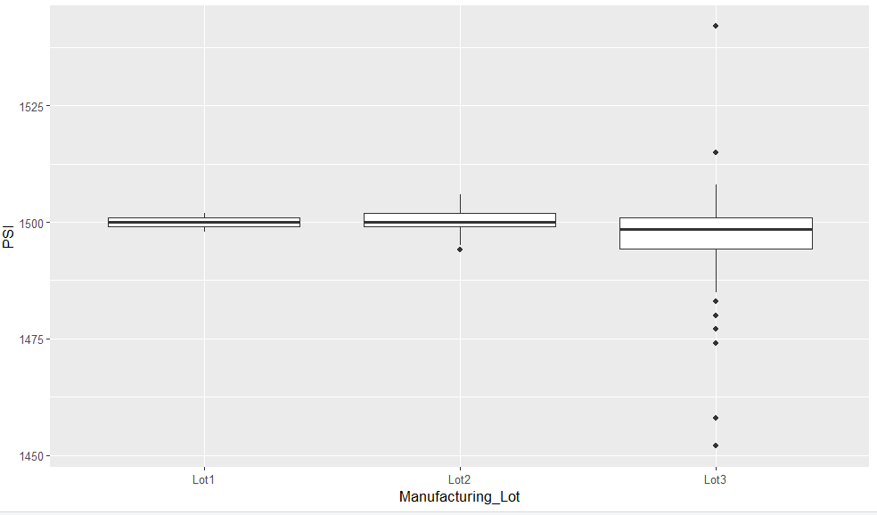
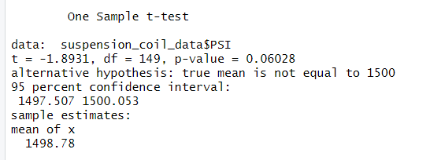

## MechaCar_Statistical_Analysis

# Overview:
A few weeks after starting his new role, Jeremy is approached by upper management about a special project. AutosRUs’ newest prototype, the MechaCar, is suffering from production troubles that are blocking the manufacturing team’s progress. AutosRUs’ upper management has called on Jeremy and the data analytics team to review the production data for insights that may help the manufacturing team.

In this challenge, we helped Jeremy and the data analytics team:
    1. Perform multiple linear regression analysis to identify which variables in the dataset predict the mpg of MechaCar prototypes.

    2. Collect summary statistics on the pounds per square inch (PSI) of the suspension coils from the manufacturing lots.

    3. Run t-tests to determine if the manufacturing lots are statistically different from the mean population.

    4. Design a statistical study to compare vehicle performance of the MechaCar vehicles against vehicles from other manufacturers. For each statistical analysis, you’ll write a summary interpretation of the findings.

## Linear Regression to Predict MPG

The MechaCar_mpg.csv dataset contains mpg test results for 50 prototype MechaCars. The MechaCar prototypes were produced using multiple design specifications to identify ideal vehicle performance. Multiple metrics, such as vehicle length, vehicle weight, spoiler angle, drivetrain, and ground clearance, were collected for each vehicle. Below, you will see a linear model designed that predicts the mpg of MechaCar prototypes using these variables from the file.

# Results

*Summary*
The variables/coefficients that provided a non-random amount of variance to the mpg values in the dataset were the vehicle length and vehicle ground clearance. They have a significant impact on miles per gallon on the MechaCar prototype. The vehicle weight, spoiler angle, and All Wheel Drive (AWD). They have p-values that indication a random amount of vatriance within the dataset. 

The slope of the linear model is not considered to be zero because the p-value is 5.35e-11. This is smaller 0.05%, which indicates that we should reject the null hypothesis.

The linear model does predict mpg of MechaCar prototypes effectively because the linear model has an r-squared value of 0.7149. This means that 71& of all miles per gallon predictions will be determined by this model. 

## Summary Statistics on Suspension Coils

The design specifciation for the MechaCar suspension coils dictate that the variance of the suspension coils must not exceed 100 pounds per square inch (PSI). 

All Manufacturing Lots: When looking at the data for all manufacturing lots, the variance of the coils is 62.29 PSI. This does not exceed the 100 PSI requirement, so it does meet the design specification.

Lot 1: The variance of the coils for Lot 1 is 0.98 PSI. This is within the 100 PSI requirement and does meet the design specification.

Lot 2: The variance of the coils for Lot 2 is 7.47 PSI. This is within the 100 PSI requirement and does meet the design specification.

Lot 3: The variance of the coils for Lot 3 is 170 PSI. This is not within the 100 PSi requirement. Thus, it does not meet the design specificaiton. 

This box plot serves as an illustration of the differences between each lot.

## T-Tests on Suspension Coils

Next, a t-test was conducted on the suspension coil data to determine if all manufacturing lots and each lot individually are statistically differnt from the population mean of 1,500 pounds per square inch.

All Manufacturing Lots: The true mean of the sample for all manufacturing lots is 1498.78 and not equal to 1,500. The p-value is equal to 0.06, meaning that there is not enough evidence to reject the null hypothesis. This means that the mean of all manufacturing lots is statistically similar to the population mean of 1,500.

Each Individual Lot:

    1. Lot 1: The true mean of the sample for Lot 1 is 1500. The p-value is equal to 1. This means that we cannot reject the null hypothesis and there is no statistical difference between this mean and the mean of 1500.
    2. Lot 2: The ture mean of the sample for Lot 2 is 1500.2. The p-value is 0.60. This means that the null hypothesis cannot be rejected and there is a similar statistical difference between this mean and the mean of 1500.
    3. Lot 3: The true mean of Lot 3 is 1496.14. The p-value is 0.04. This is a little different, in that the p-value is less than significant (less than 0.05). This lets us know to reject the null hypothesis and the mean is not statistically different from the mean of 1500.

This information lets us know that something went wrong with Lot 3 and their production. Manufacturers should check the system for failures and inspect the suspension coils to ensure that they will meet quality criteria.

## Study Design: MechaCar vs. Competition

A statistical study that can quantify how the MechaCar would perform against competition could be comparing their models with at least 3 other models across different manufacturers over the last 5 years.

# Metrics

Some metrics that data could be collected for across models for different manufactureres could be the following:
    - Current Price: Dependent Variable
    - Safety Rating: Independent Variable
    - MPG (fuel efficiency): Independent Variable
    - Engine (horse power): Independent Variable
    - Maintenance Costs: Independent Variable

# Hypothesis

The null hypothesis would be that MechaCar is priced correctly based on key factors for perfomrance on its' model.

The alternative hypothesis would be that MechaCar is not priced correctly based on key factors for perfomrance on its' model.

# Statistical Tests

The statistical test I would use to test the hypothesis would be a linear regresstion. The reason being is that you could determine the factors that have the highest correlation with the current selling price (the dependent variable). You would be able to determine which combination of metrics has the best impact on price. 

In order to run this statistical analysis, you would need data on the different competitor's manufacturing metrics for the last five years, as well as MechaCar's.